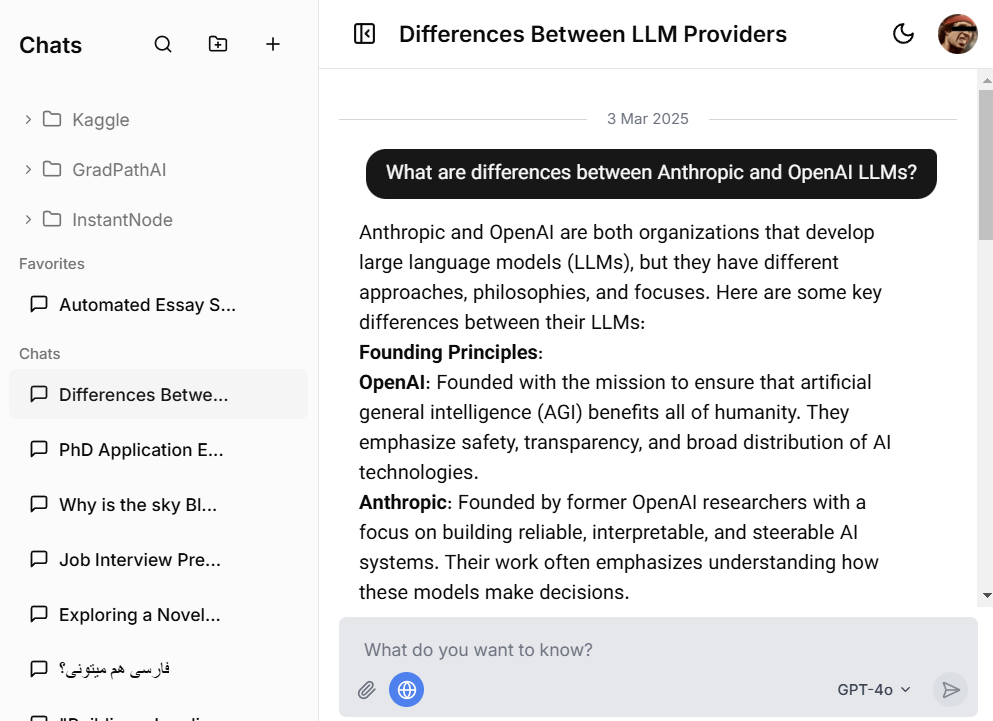

# JustBYOK - Bring Your Own Key AI Chat Platform

<p align="center">
  
</p>

A modern, feature-rich chat platform that enables users to interact with various Language Models (LLMs) using their own API keys. Built with Next.js and React, this platform offers a seamless experience for managing conversations with different AI models while ensuring data privacy through local storage.

<p align="center">
  
</p>

## Features

- **Multi-Model Support**
  - OpenAI Models (GPT-4o, GPT-4o mini, GPT 4.5 Preview)
  - Anthropic Models (Claude Sonnet 3.7, Claude Sonnet 3.7 Reasoning)
  - Google Models (Gemini Flash 2)
  - Easy model switching with an intuitive selector

- **Secure API Key Management**
  - Store API keys locally in the browser
  - Support for multiple providers (OpenAI, Anthropic, Google)
  - Secure key storage with encryption

- **Advanced Chat Features**
  - Real-time streaming responses
  - Message pinning and organization
  - Chat folder management
  - Favorite conversations
  - Message editing and context management
  - File attachment support

- **Customization & Settings**
  - Adjustable model parameters (temperature, tokens, etc.)
  - System message customization
  - Theme customization (light/dark mode)
  - Font size and message bubble style options

- **Data Privacy & Storage**
  - All data stored locally in browser
  - IndexedDB for chat history
  - LocalStorage for settings
  - No server-side storage required

- **Modern UI/UX**
  - Responsive design with Tailwind CSS
  - Custom UI components with shadcn/ui
  - Smooth animations and transitions
  - Intuitive drag-and-drop interface

## Tech Stack

- **Frontend Framework:** Next.js 13+ with React 18
- **Language:** TypeScript
- **Styling:** 
  - Tailwind CSS
  - shadcn/ui components
  - Lucide React icons
- **State Management:** Custom React hooks
- **Storage:**
  - IndexedDB (chat history)
  - LocalStorage (settings)
- **AI Integration:**
  - OpenAI API
  - Anthropic API
  - Google Gemini API
- **Development Tools:**
  - ESLint
  - PostCSS
  - TypeScript compiler

## Getting Started

### Prerequisites

- Node.js 18.0 or later
- npm or yarn
- API keys for desired LLM providers

### Installation

1. Clone the repository:
   ```bash
   git clone https://github.com/danielhafezi/JustBYOK.git
   cd JustBYOK
   ```

2. Install dependencies:
   ```bash
   npm install
   # or
   yarn install
   ```

3. Run the development server:
   ```bash
   npm run dev
   # or
   yarn dev
   ```

4. Open [http://localhost:3000](http://localhost:3000) in your browser

### Configuration

1. Launch the application
2. Open Settings to configure:
   - API keys for different providers
   - Model parameters
   - UI preferences
   - System messages

## Usage

1. **Starting a Chat:**
   - Click "New Chat" button
   - Select your preferred model
   - Start typing your message

2. **Managing Conversations:**
   - Create folders for organization
   - Pin important messages
   - Star favorite conversations
   - Edit messages as needed

3. **Customizing Experience:**
   - Adjust model parameters
   - Customize UI settings
   - Configure system messages
   - Manage API keys

## Contributing

Contributions are welcome! Please feel free to submit a Pull Request.

1. Fork the repository
2. Create your feature branch (`git checkout -b feature/AmazingFeature`)
3. Commit your changes (`git commit -m 'Add some AmazingFeature'`)
4. Push to the branch (`git push origin feature/AmazingFeature`)
5. Open a Pull Request

## License

Distributed under the MIT License. See `LICENSE` for more information.

## Acknowledgments

- Built with [Next.js](https://nextjs.org/)
- UI components from [shadcn/ui](https://ui.shadcn.com/)
- Icons by [Lucide](https://lucide.dev/)